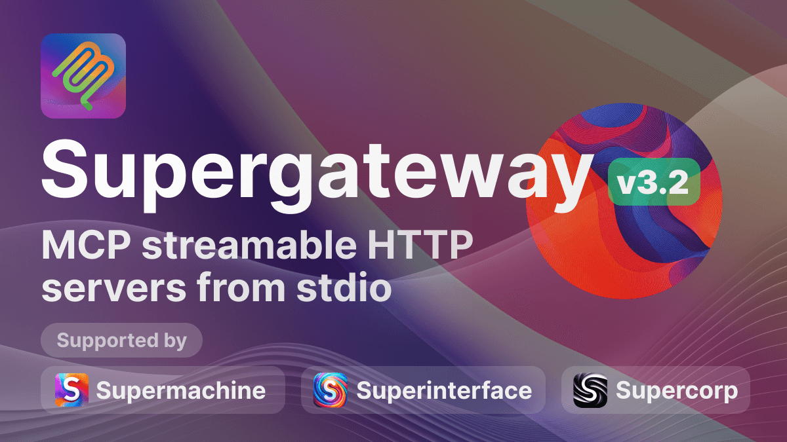

**Supergateway** runs a **stdio-based MCP server** over **SSE (Server-Sent Events)** with one command. This is useful for remote access, debugging, or connecting to SSE-based clients when your MCP server only speaks stdio.

Supported by [superinterface.ai](https://superinterface.ai) and [supercorp.ai](https://supercorp.ai).

## Installation & Usage

Run Supergateway via `npx`:

```bash
npx -y supergateway --port 8000 \
    --stdio "npx -y @modelcontextprotocol/server-filesystem /Users/MyName/Desktop"
```

- **`--port 8000`**: Port to listen on (default: `8000`)
- **`--stdio`**: Command that runs an MCP server over stdio

Once started:
- **SSE endpoint**: `GET http://localhost:8000/sse`
- **POST messages**: `POST http://localhost:8000/message`

## Example with MCP Inspector

1. **Run Supergateway**:
   ```bash
   npx -y supergateway --port 8000 \
       --stdio "npx -y @modelcontextprotocol/server-filesystem /Users/MyName/Desktop"
   ```
2. **Use MCP Inspector**:
   ```bash
   npx @modelcontextprotocol/inspector --uri http://localhost:8000/sse
   ```
   You can then read resources, list tools, or run other MCP actions through Supergateway.

## Using with ngrok

You can use [ngrok](https://ngrok.com/) to share your local MCP server with remote clients:

```bash
npx -y supergateway --port 8000 \
    --stdio "npx -y @modelcontextprotocol/server-filesystem ."
# In another terminal:
ngrok http 8000
```

ngrok then provides a public URL.

## Why MCP?

[Model Context Protocol](https://spec.modelcontextprotocol.io/) standardizes how AI tools exchange data. If your MCP server only speaks stdio, Supergateway exposes an SSE-based interface so remote clients (and tools like MCP Inspector) can connect without extra server changes.

## Contributing

Issues and PRs are welcome. Please open one if you have ideas or encounter any problems.

## License

[MIT License](./LICENSE.md)
